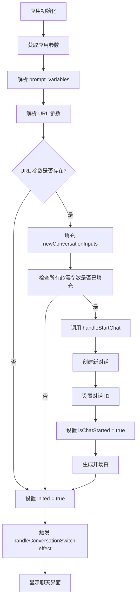

# 自动启动对话功能实施计划

## 需求描述

当通过 URL 参数填充表单后，如果所有必需的参数都已经填充完成，自动调用 `handleStartChat` 启动对话，显示开场白，用户可以直接输入消息。

## 当前代码分析

### 相关代码位置

1. **URL 参数解析和填充**（第 283-292 行）：
```typescript
// 解析 URL 参数并填充到表单
try {
  const urlParams = await parseUrlParams(prompt_variables)
  // 直接使用返回的参数对象，无需额外的 JSON.parse 和映射逻辑
  if (Object.keys(urlParams).length > 0) {
    setNewConversationInputs(urlParams)
  }
} catch (error) {
  console.error('Failed to parse URL parameters:', error)
  // 不抛出错误，允许应用继续运行
}
```

2. **handleStartChat 函数**（第 89-96 行）：
```typescript
const handleStartChat = (inputs: Record<string, any>) => {
  createNewChat()
  setConversationIdChangeBecauseOfNew(true)
  setCurrInputs(inputs)
  setChatStarted()
  // parse variables in introduction
  setChatList(generateNewChatListWithOpenStatement('', inputs))
}
```

3. **checkCanSend 函数**（第 317-331 行）：
```typescript
const checkCanSend = () => {
  if (currConversationId !== '-1') { return true }

  if (!currInputs || !promptConfig?.prompt_variables) { return true }

  const inputLens = Object.values(currInputs).length
  const promptVariablesLens = promptConfig.prompt_variables.length

  const emptyInput = inputLens < promptVariablesLens || Object.values(currInputs).find(v => !v)
  if (emptyInput) {
    logError(t('app.errorMessage.valueOfVarRequired'))
    return false
  }
  return true
}
```

### 关键变量和状态

- `promptConfig.prompt_variables`: 包含所有必需的参数配置
- `newConversationInputs`: 新对话的输入参数
- `isChatStarted`: 对话是否已开始的标志
- `inited`: 应用是否已初始化完成

## 实施方案

### 步骤 1：创建参数完整性检查函数

在 `app/components/index.tsx` 中创建一个辅助函数 `checkAllRequiredParamsFilled`，用于检查所有必需参数是否已填充。

**函数签名**：
```typescript
const checkAllRequiredParamsFilled = (
  inputs: Record<string, any> | null,
  promptVariables: PromptVariable[] | null
): boolean => {
  if (!inputs || !promptVariables) {
    return false
  }

  // 检查必需参数的数量
  const requiredVariables = promptVariables.filter(v => v.required)
  if (requiredVariables.length === 0) {
    return true // 没有必需参数，认为已填充
  }

  // 检查所有必需参数是否都有值
  for (const variable of requiredVariables) {
    const value = inputs[variable.key]
    if (!value || value === '') {
      return false
    }
  }

  return true
}
```

**位置**：在 `checkCanSend` 函数之前（约第 317 行之前）

### 步骤 2：在 URL 参数填充后添加自动启动逻辑

在 URL 参数解析和填充后（第 287 行之后），添加参数完整性检查和自动启动逻辑。

**修改位置**：第 283-292 行

**修改后的代码**：
```typescript
// 解析 URL 参数并填充到表单
try {
  const urlParams = await parseUrlParams(prompt_variables)
  // 直接使用返回的参数对象，无需额外的 JSON.parse 和映射逻辑
  if (Object.keys(urlParams).length > 0) {
    setNewConversationInputs(urlParams)
    
    // 检查所有必需参数是否已填充
    if (checkAllRequiredParamsFilled(urlParams, prompt_variables)) {
      // 所有必需参数已填充，自动启动对话
      handleStartChat(urlParams)
    }
  }
} catch (error) {
  console.error('Failed to parse URL parameters:', error)
  // 不抛出错误，允许应用继续运行
}
```

### 步骤 3：确保执行顺序

确保自动启动逻辑在 `setInited(true)` 之前执行，以避免状态更新冲突。

**当前执行顺序**：
1. 解析 URL 参数并填充（第 283-292 行）
2. 设置当前对话 ID（第 294 行）
3. 设置 inited 为 true（第 296 行）

**保持此顺序不变**，因为：
- `handleStartChat` 会调用 `createNewChat()`，这会修改 `conversationList`
- `setInited(true)` 会触发 `handleConversationSwitch` effect
- 需要确保 `handleStartChat` 在 `inited` 变为 true 之前完成

## 流程图



## 注意事项

1. **参数完整性检查**：
   - 只检查 `required: true` 的参数
   - 如果没有必需参数，认为已填充
   - 检查参数值是否为空字符串或 undefined

2. **状态更新顺序**：
   - `setNewConversationInputs` 必须在 `handleStartChat` 之前调用
   - `handleStartChat` 会使用 `newConversationInputs` 的值
   - 确保 `inited` 在最后设置为 true

3. **边界情况处理**：
   - URL 参数部分填充：不自动启动，等待用户手动填充
   - URL 参数全部填充但包含非必需参数：自动启动
   - URL 参数为空：不自动启动
   - 解析失败：不自动启动，允许应用继续运行

4. **用户体验**：
   - 自动启动后，用户可以直接输入消息
   - 开场白会显示在聊天界面
   - 用户可以继续编辑输入参数（如果 `canEditInputs` 为 true）

## 测试场景

1. **场景 1：所有必需参数通过 URL 填充**
   - URL: `?param1=value1&param2=value2`
   - 预期：自动启动对话，显示开场白

2. **场景 2：部分必需参数通过 URL 填充**
   - URL: `?param1=value1`
   - 预期：不自动启动，等待用户手动填充剩余参数

3. **场景 3：URL 参数为空**
   - URL: 无参数
   - 预期：不自动启动，显示表单

4. **场景 4：URL 参数包含非必需参数**
   - URL: `?param1=value1&optionalParam=value2`
   - 预期：自动启动对话（如果 param1 是唯一必需参数）

5. **场景 5：URL 参数解析失败**
   - URL: 包含无效的 base64 编码
   - 预期：不自动启动，应用继续运行

## 实施检查清单

- [ ] 创建 `checkAllRequiredParamsFilled` 辅助函数
- [ ] 在 URL 参数填充后添加参数完整性检查
- [ ] 添加自动调用 `handleStartChat` 的逻辑
- [ ] 验证状态更新顺序正确
- [ ] 测试所有场景
- [ ] 确保不影响现有功能